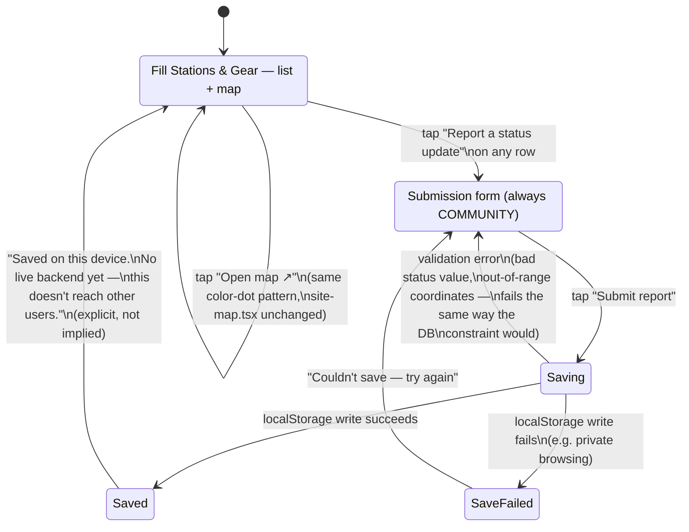
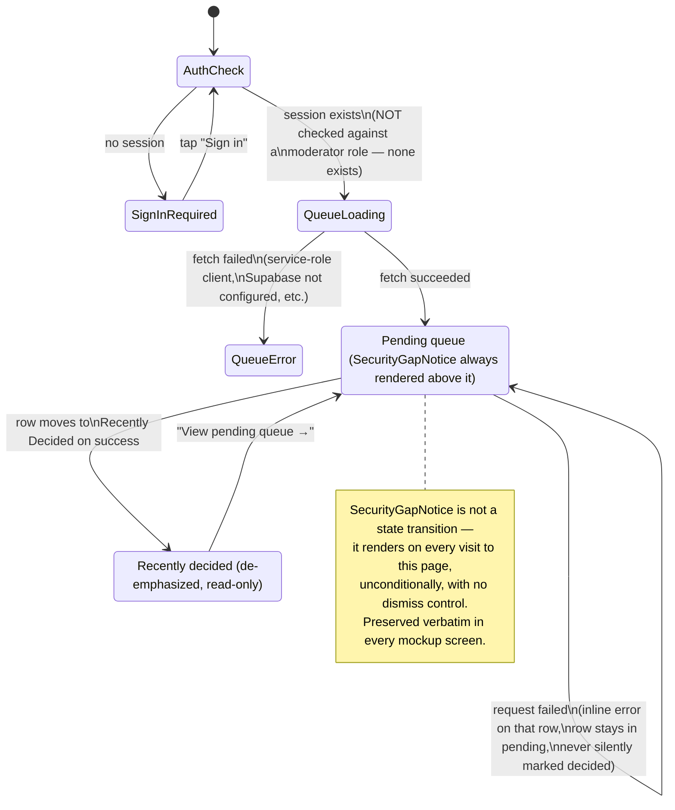

# LDS Status Feed + Camera-Source Moderation Queue

Covers two related but distinct flows that share one property: **both are the
least consumer-glamorous surfaces in the product**, and per
`creative/CREATIVE_BACKLOG.md`'s own framing for this round, "clarity and
moderator efficiency matter more than brand moments here." Designed against
`creative/design-system/DESIGN_SYSTEM.md` (binding) — same palette/type/
spacing tokens as every other flow, applied in a denser, more utilitarian
register for the admin-facing half of this flow specifically.

Grounded in the real, already-built code (not new design work over an empty
page, unlike the other three rounds):
- `src/components/lds/lds-status.ts` — append-only `lds_status` log,
  `latestStatusPerShop()` collapses it client-side to "current status."
- `src/components/lds/last-verified-badge.tsx` — thin wrapper around
  `FreshnessBadge` with a "Last verified" caption, 24h staleness default.
- `src/components/lds/lds-submission-form.tsx` — community submission form,
  hardcoded `COMMUNITY` provenance, no `VERIFIED` option anywhere in the form.
- `src/components/site-map.tsx` — existing colored-dot marker pattern for LDS
  pins (`STATUS_DOT_CLASSES`), reused here rather than reinvented.
- `src/app/moderation/camera-sources/page.tsx` + `queue-client.tsx` — the
  real moderation queue: server-fetched pending/decided lists via a
  service-role client (because RLS only lets a normal user read their own
  submissions), `SecurityGapNotice` disclosing the "gated on signed-in, not
  moderator" gap, Approve/Reject wired to a real API route.
- `src/components/camera-source-status-badge.tsx` — `pending_review` /
  `approved` / `rejected` badge, matched exactly (not reinvented) in every
  mockup here.

Mockups: `creative/mockups/lds-moderation/`.

## Flow 1 — LDS fill-station status (consumer-facing)

## Flow 2 — Camera-source moderation queue (admin-facing)

## Information-density rationale

### Why the LDS list/map screen stays mobile-first and lower-density than the moderation queue

Fill-station status is read by a diver standing at the water's edge deciding
whether to detour for an air fill — the same "wet or gloved hands, outdoor
glare, one-handed" context `DESIGN_SYSTEM.md` §4 calls out for the whole
consumer product. `01-lds-status-list.html` and `02-lds-submission-form.html`
stay at the same 390px mobile frame and 44px touch-target floor as every
other consumer mockup in this repo. The one deliberate density move here
(and the reason this file still reads as "utilitarian" relative to, say,
`map-exploration`'s site-detail screen) is putting a **map preview strip and
a full list on one screen** rather than a full-bleed map with a separate list
tab — a diver comparing three nearby stations' status/freshness at a glance
benefits more from a scannable list than from panning a map to find the same
three pins.

### Why the moderation queue drops to a denser, desktop-reasonable register

`03`–`05` widen to an 820px desk frame and shrink row padding, badge size,
and type scale relative to every consumer screen in this repo. This is a
deliberate, scoped exception to `DESIGN_SYSTEM.md` §4's "generous whitespace
over density... this is a low-noise, calm product, not a data-dense
dashboard" — justified specifically because the CREATIVE_BACKLOG task
description carves this flow out by name ("this is the one flow where you
should lean utilitarian... clarity and moderator efficiency matter more than
brand moments here") and because the actual usage context is different in
every relevant way: a moderator reviewing camera-source candidates is at a
desk with a mouse and a monitor, not wet-handed at a beach with one thumb.
Same tokens throughout (depth scale, semantic hues, `Space Grotesk` on the
page title, `Geist Sans` body) — only spacing and information density flex.

### Touch-target sizing for Approve/Reject: 36px, not 44px or 56px

`DESIGN_SYSTEM.md` §4 sets 44px as the floor "everywhere" and 56px for
safety-critical controls (Safe-Return start/check-in/silence). Neither
applies cleanly here, so this mockup makes an explicit, documented exception
rather than silently ignoring the rule:

- **Not 56px** — approve/reject isn't life-safety-critical in the way the
  Safe-Return timer is; treating it with the same visual weight would
  overstate what's actually at stake (a webcam source going live vs. not) and
  waste desk-screen space that a moderator triaging a real queue needs for
  scanning many rows at once.
- **Not the 44px mobile floor either** — that number specifically encodes
  imprecise-touch, wet/gloved-hand accuracy. A moderator using a mouse has
  pixel-precise pointing; holding the touch floor here would only make the
  queue harder to scan without buying any real accuracy benefit.
- **36px chosen, not smaller** — still clears WCAG 2.5.8's 24×24px AA target
  minimum with real margin, and Approve/Reject sit 12px apart specifically
  because — per `SecurityGapNotice` — *any* signed-in user can fire these
  actions and there's no undo/role gate behind them yet. That's exactly the
  kind of one-off action where a mis-click is more consequential than usual,
  even though 56px-scale friction (like Safe-Return's hold-to-confirm) would
  be the wrong tool here — this isn't a destructive-with-real-world-stakes
  action in the same register, it's a moderation call that can be reversed by
  another review pass.

### Why the recently-decided list is visually quieter, not just lower on the page

`05-moderation-recently-decided.html` deliberately drops every affordance
that read as "actionable" in the pending queue: no card elevation, no
Approve/Reject buttons, smaller type, muted zinc-800 borders instead of the
`--depth-border` used everywhere else, and status badges rendered at 70%
scale. This isn't just visual hierarchy for its own sake — it encodes a real
constraint: **this list is an audit trail, not a second place decisions get
made.** A moderator should never be able to mistake a decided row for one
still awaiting action, especially given the `SecurityGapNotice`'s point that
any signed-in user, not a vetted moderator, can act here — a confusing
UI that invited re-review or accidental re-action on an already-decided row
would compound that gap rather than just disclose it.

## How the security-gap disclosure was preserved, not softened

The task brief was explicit that this is the one place in this flow where
honesty-over-polish matters as much as it does on the Safe-Return
expired/alarm screen, and that a fake "Moderator" badge/title must never be
invented since no such role exists in the real system. Concretely, across
`03`, `04`, and `05`:

1. **Copy is verbatim**, spot-checked word-for-word against
   `SecurityGapNotice` in `src/app/moderation/camera-sources/page.tsx`:
   *"This page is gated on 'signed in,' not 'is a moderator.'"* and the full
   explanatory paragraph, including the `0002_rls.sql` / `supabase/README.md`
   / `review/route.ts` cross-references. Nothing was trimmed, hedged, or
   rewritten to sound less alarming.
2. **No dismiss control, anywhere.** Every mockup that shows the notice
   renders it with no close icon, no "got it" button, no collapse affordance
   — matching the real component exactly, which also has none.
3. **`04-moderation-security-notice.html` makes "persistent" a real, checkable
   property of the mockup**, not just a claim in a code comment: the notice
   uses `position: sticky` inside the queue's own scrolling region (not a
   page-level header that scrolls away), so scrolling through a long pending
   list — simulated with six rows deep enough to require scrolling — proves
   it stays pinned rather than asserting it would. Three annotation callouts
   alongside the frame call out the "no dismiss control," "sticky, not a
   toast," and "reappears every visit, no 'don't show again'" decisions
   explicitly, since those are review-facing notes, not part of the shipped
   UI itself (kept outside the `.desk` frame for that reason).
4. **No moderator-role visual was added anywhere** — not on the queue header,
   not near Approve/Reject, not as a page title change. The queue is titled
   plainly "Camera Sources — Moderation Queue," matching the real page, with
   no badge implying the signed-in user has been vetted as anything beyond
   "signed in." This was the most tempting shortcut to take for a "cleaner"
   admin-tool look (a role chip is a common enough admin-UI pattern that
   inventing one would have looked native) and was deliberately not taken.
5. **The notice's visual weight is proportionate to a real warning**, not
   decorative chrome: amber (the system's caution semantic, `DESIGN_SYSTEM.md`
   §2.2), a warning-triangle icon, and in `04` an explicit "always shown, not
   dismissible" eyebrow label — legible at a glance, not a footnote a
   moderator would tune out after the first visit.
