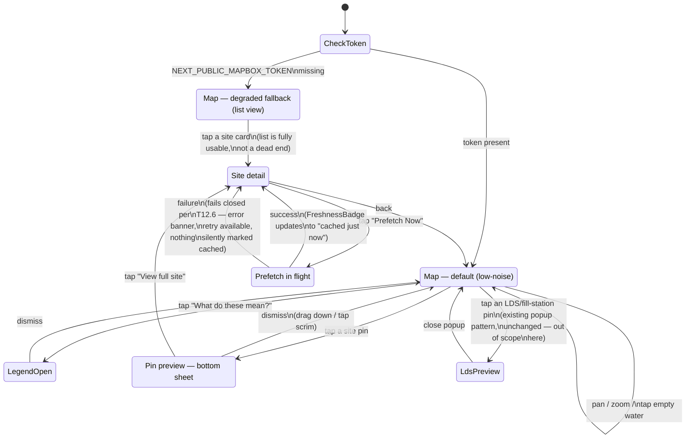

# Map Exploration + Site Detail

Covers: the Map tab's default state, the Mapbox-degraded fallback (no
`NEXT_PUBLIC_MAPBOX_TOKEN` configured), pin tap → compact preview
(bottom sheet) → full site detail, the legal/access-status badge system (all
five `legal_access_status` states, including the `null` "not yet assessed"
state), and the "Prefetch Now" entry point on site detail. Designed against
`creative/design-system/DESIGN_SYSTEM.md` (binding) and grounded in the real
schema/components already in `src/` (see file list below) — there is no
site-detail page in the real app yet, so this is new design work, not a
redesign of something shipped.

Grounded in:
- `src/components/site-map.tsx` — existing Mapbox component, LDS marker
  pattern (colored status dot on the map, full provenance/last-verified in
  a popup on tap), degrades to a plain placeholder without a token.
- `src/components/provenance-badge.tsx` — `VERIFIED`/`COMMUNITY`/
  `MODEL_INFERRED` badge, exact styling matched (not reinvented) everywhere
  it appears in these mockups.
- `src/components/freshness-badge.tsx`, `src/components/lds/last-verified-badge.tsx`
  — "cached as of [time]" / staleness treatment, exact styling matched.
- `supabase/migrations/0001_init.sql` — `sites` (`legal_access_status` enum,
  nullable = not yet assessed) and `hazard_reports`.
- `src/components/prefetch-button.tsx`, `src/components/pretrip-checklist.tsx`
  — the real "Prefetch Now" entry point, styling matched on site detail.

Mockups: `creative/mockups/map-exploration/`.

## Flow / state diagram



## Pin-rendering decision logic

```mermaid
flowchart TD
    A[Site record] --> B{hazard_reports\nfor this site?}
    B -- none on file --> C[Pin fill: sky-500\ncalm / default]
    B -- one or more --> D[Pin fill: amber-500\n\"something to check\"]

    A --> E{provenance}
    E -- VERIFIED --> F[Pin ring: sky-400\nmatches ProvenanceBadge]
    E -- COMMUNITY --> G[Pin ring: violet-400\nmatches ProvenanceBadge]

    A --> H{legal_access_status}
    H -- open / null --> I[No corner glyph\nlow-noise default]
    H -- marine_protected_area\nor seasonal_closure --> J[Amber corner glyph\non the pin]
    H -- private_property\nor restricted_other --> K[Rose corner glyph\non the pin]

    C & D & F & G & I & J & K --> L[Rendered pin:\nshape + fill + ring + optional glyph]
    L --> M[Tap → bottom sheet\nshows full ProvenanceBadge\n+ full legal-access badge\n+ text, never just the\nglyph alone]
```

## Rationale

### Why the map pin is never "just a color"

CLAUDE.md is explicit that a pin must never render with "no lineage," and
THREAT_MODEL.md §1 independently flags "a color pin with no lineage" as a
trust-integrity failure mode (a bad actor marking a hazardous site "clear,"
or vice versa, with no way to see who said so). The existing LDS marker
pattern in `site-map.tsx` already solves this correctly for fill-station
pins — colored dot on the map for a fast scan, full `ProvenanceBadge` +
`LastVerifiedBadge` in the popup the moment you tap in. This flow extends
that exact pattern to site pins rather than inventing a new one:

- **Pin fill color = hazard-report signal, not a safety verdict.**
  Deliberately two states only: `sky-500` (calm/default — no hazard reports
  on file) and `amber-500` (one or more hazard reports on file, regardless
  of who filed them). This is **informational** ("something's been
  reported, go check"), not a claim ("this site is dangerous" /
  "this site is safe"). `hazard_reports` in the real schema has no severity
  field and is unverified-by-default (`COMMUNITY` provenance unless
  promoted) — a red/green safety-verdict pin would imply a certainty the
  data can't back, which CLAUDE.md's engineering standards explicitly rule
  out ("never let a UI imply a guarantee the system can't back"). `rose` is
  intentionally never used for the pin fill itself — it's reserved for
  actually-confirmed danger states elsewhere in the product (Safe-Return
  expiry), so a diver scanning the map doesn't have two different things
  both screaming "red."
- **Pin ring color = provenance**, reusing `ProvenanceBadge`'s exact hues
  (`sky` = `VERIFIED`, `violet` = `COMMUNITY`) as a ring around the pin
  shape. This means lineage is visible *before* any tap, not just after —
  literally cannot render a pin with "no lineage," satisfying the CLAUDE.md
  requirement at the map layer itself, not only in the sheet/detail view.
- **A small corner glyph = legal/access restriction**, shown *only* for the
  four non-`open` restricted states (amber for MPA/seasonal closure, rose
  for private property/restricted-other). `open` and `null` (not yet
  assessed) both render with **no glyph** at the pin level — this keeps the
  default map low-noise (most sites are unrestricted, so most pins stay
  clean) while still literally putting "an explicit access/legal-status
  badge on the pin" for the sites where it actually matters, per CLAUDE.md's
  instruction. The full distinction between "open" (confirmed, no
  restriction) and "not yet assessed" (unknown) is preserved and made
  explicit one layer in, on the preview sheet and detail view's dedicated
  badge — see below.
- **Shape, not just color, distinguishes site pins from LDS pins** sharing
  the same map: site pins use a teardrop map-pin silhouette (Lucide
  `map-pin`), LDS/fill-station pins keep the existing small filled circle.
  Two different marker families reduces scanning ambiguity more cheaply
  than adding more color, keeping the "low-noise" default intact even as
  the map gets busier.

### The legal/access-status badge system (five states)

This is deliberately a **different badge shape/icon family than
`ProvenanceBadge`**, so "who vouches for this data" (provenance) is never
visually confused with "can I legally dive here" (legal/access status) —
two orthogonal, both-important pieces of information. `ProvenanceBadge` uses
plain text glyphs (✓ ◐ ✦); the legal-access badge uses small outline Lucide
icons, per DESIGN_SYSTEM.md §5. Same pill shape/sizing as `ProvenanceBadge`
(so they read as one "badge family" when shown side by side), different
color logic:

| `legal_access_status` | Color | Icon | Label | Why |
|---|---|---|---|---|
| `open` | emerald | shield-check | "Open access" | The one genuinely reassuring state — explicitly *confirmed* clear, not a default assumption. |
| `marine_protected_area` | amber | shield-alert | "Marine Protected Area" | Caution, not prohibition — many MPAs allow diving under specific rules. |
| `seasonal_closure` | amber | calendar-x | "Seasonal closure" | Time-bound restriction — same caution tier as MPA. |
| `private_property` | rose | lock | "Private property" | Access requires explicit permission — higher-severity tier. |
| `restricted_other` | rose | triangle-alert | "Access restricted" | Catch-all for anything not covered above — same severity tier as private property, deliberately non-specific copy since the underlying reason varies. |
| `null` (not yet assessed) | zinc, **dashed border** | help-circle | "Not yet assessed" | **Not the same as `open`.** CLAUDE.md/the schema comment are explicit these are distinct states — an unassessed site must never read as "confirmed fine." |

The dashed border on the `null` state deliberately reuses the exact visual
grammar `ProvenanceBadge` already established for `MODEL_INFERRED`
("dashed border reinforces estimate/unconfirmed, not a settled fact") —
it's the same underlying meaning (unconfirmed status), so reusing the
pattern rather than inventing a new one keeps the badge vocabulary
consistent across the app, not just within this one flow.

### The Mapbox-degraded fallback is a list, not an error box

The real `site-map.tsx` today just renders a dashed placeholder with a
sentence of text when `NEXT_PUBLIC_MAPBOX_TOKEN` is missing. That's a
reasonable stub for a code path with no design yet, but the brief calls for
a *real, non-broken-looking* fallback — so this flow redesigns it as a
**scrollable list of the same sites**, each rendered as a card with its
provenance badge and legal-access badge intact (nothing about the trust/
legal information is lost, only the spatial map view). Framed calmly per
DESIGN_SYSTEM.md §7 ("say plainly what's true," no alarm language): "Map
view isn't available in this build — showing sites as a list instead."
Tapping a card goes straight to the same site-detail view the map pin flow
uses, so the degraded path never dead-ends — it's a genuinely different but
fully functional way to reach the same destination, not a broken map with
an apology on it.

### Site detail — "not yet assessed" is not hidden, it's a first-class state

Per the explicit CLAUDE.md requirement, the site-detail mockups show three
distinct combinations, not just "the happy path":
`VERIFIED` + `open` (La Jolla Cove — confirmed clear), `COMMUNITY` + `null`
(a community-submitted site nobody has checked the legal status of yet, and
which *does* have an open hazard report — proving the hazard/legal axes are
independent of each other), and `VERIFIED` + `marine_protected_area` (a
restricted site rendered with the same weight/prominence as the open one,
not buried or de-emphasized — a restriction is safety/legal-relevant
information, not a lesser detail).

### Judgment calls / flagged for founder review

- **Hazard-report pin coloring is a placeholder scheme for v1**, not a
  telemetry system — `hazard_reports` has no severity field in the current
  schema, so "has any report vs. none" is the only signal available today.
  CLAUDE.md's "dynamic color-coded telemetry pins" language points at a
  richer scheme once Task 17–20's webcam/vision pipeline lands
  (`MODEL_INFERRED` visibility/chop readings) — that will likely want its
  own color axis (e.g. a third dot or a ring-within-ring), not a redesign
  of what's here, since it's additive.
- **Legal-access corner glyph vs. a full always-visible badge on the pin**:
  chose the minimal glyph (icon only, no text) to protect the "low-noise
  default" principle at map scale — full badge text only appears once a
  user commits to a tap (preview sheet or detail). If user testing shows
  people miss the glyph at map zoom levels, the fallback is a
  color-coded pin *border* instead of a corner glyph — flagged here as an
  alternative worth prototyping, not decided against permanently.
- **No "directions" deep link was wired to a real maps app** — mocked as a
  static icon button; actual behavior (native maps intent vs. web maps URL)
  is an implementation detail for whoever builds this, not a design
  decision this round needed to resolve.
