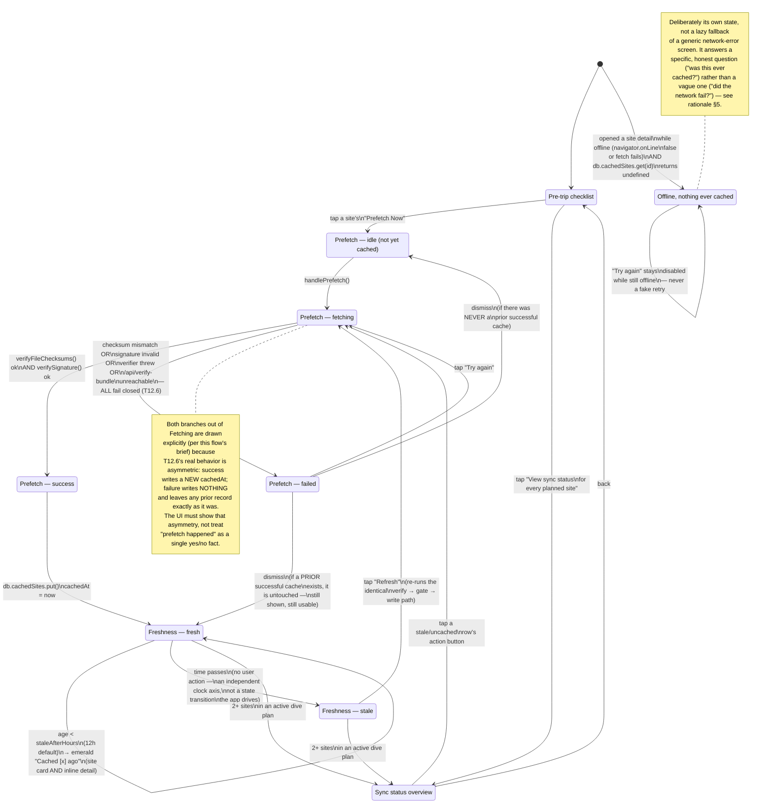

# Offline Prefetch + Sync Status

Covers: the pre-trip checklist entry point, the manual "Prefetch Now"
trigger's full in-flight arc (idle → fetching → success / fails-closed
failure), the freshness/staleness display in both a site-card and an
inline site-detail context, a dedicated sync-status overview for a
multi-site dive plan, and the offline-with-nothing-cached case. Designed
against `creative/design-system/DESIGN_SYSTEM.md` (binding) and grounded in
the real, already-built code — not fantasy screens:

- `src/components/prefetch-button.tsx` — the real manual trigger. `status`
  is exactly `"idle" | "loading" | "success" | "error"`; a failed
  `verifyBundleIntegrity()` call is logged and surfaces `"error"` *without*
  ever calling `db.cachedSites.put(...)` — fail-closed is already correct in
  the shipped code, this flow just gives it a visible face.
- `src/components/pretrip-checklist.tsx` — the real entry point copy
  ("Prefetch is best-effort — the service worker only updates its cache
  when you actually have the app open") and its mock dive-plan shape
  (`PretripPlanEntry[]`).
- `src/components/freshness-badge.tsx` — the real freshness/staleness
  logic: `isStale = !isValid || ageHours > staleAfterHours` (default 12h).
  Exactly two visual states (emerald / amber) — a missing or invalid
  `cachedAt` fails toward **stale**, never toward a false "fresh." This
  flow's mockups reproduce that logic with real example ages, not a
  third invented color.
- `src/lib/offline/bundle-verification.ts` — `verifyBundleIntegrity()`:
  checksum check, then signature check, `ok: true` only if both pass.
  Missing files, hashing errors, a thrown verifier, and a 404/unreachable
  `/api/verify-bundle` all resolve to `ok: false` — never silently `true`.
- `src/lib/db.ts` — `CachedSiteRecord`/`CachedHazardRecord`, both keyed on
  `cachedAt`, the single source of truth the freshness badge reads. A
  failed prefetch attempt never touches an existing record — there is no
  code path that clears a good cache because a later refresh failed.

There is no real dive-plan or multi-site UI in `src/` yet (Task 14/16
territory) — the sync-status overview (§4 below) is new design work built
on the same mock `PretripPlanEntry` shape `pretrip-checklist.tsx` already
uses, not a redesign of something shipped.

Mockups: `creative/mockups/offline-prefetch/`.

## Flow / state diagram

## Screens delivered

| Step | File | What it shows |
|---|---|---|
| Checklist | `01-pretrip-checklist.html` | Entry point: best-effort framing, per-site prefetch, bulk action, link to sync overview |
| Prefetch idle | `02-prefetch-idle.html` | Site detail, never cached — "Not cached yet" neutral pill, primary CTA |
| Prefetch fetching | `03-prefetch-fetching.html` | Indeterminate progress, named steps (download → verify → save) |
| Prefetch success | `04-prefetch-success.html` | Quiet checkmark + settle animation, "Cached just now," Refresh affordance |
| Prefetch failed | `05-prefetch-failed.html` | Fails closed: prior stale cache shown untouched, calm rose error banner, Retry |
| Freshness states | `06-freshness-states.html` | Comparison sheet: fresh (2 min), aging-but-fine (8h), stale (14h) — site card + inline detail |
| Sync status overview | `07-sync-status-overview.html` | Multi-site dive-plan screen: per-site status + bulk action + honest summary line |
| Offline, nothing cached | `08-offline-nothing-cached.html` | Persistent offline pill + specific "never prefetched" empty state, disabled retry |

## Rationale: making "best-effort" read as reassuring, not alarming

The brief for this flow is tonal before it's visual: a diver reading this
screen in a driveway with one bar of signal, about to lose it entirely,
needs the app's honesty to build trust, not anxiety. Four decisions carry
that weight:

1. **Frame prefetch as a ritual, not a warning.** The checklist opens with
   "Before you lose signal" — a practical heads-up, the way a dive buddy
   would say "grab your gear," not a system alert. The best-effort caveat
   ("your phone only updates its offline copy when this app is actually
   open") is stated once, plainly, in the same breath as the action that
   fixes it ("tap Prefetch Now") — the limitation and its mitigation are
   never separated, so the diver never reads the caveat as a dead end.
   `pretrip-checklist.tsx`'s real copy is kept close to verbatim for this
   reason — it already gets this right.

2. **Specificity is what makes honesty feel calm.** A vague "may be out of
   date" reads as evasive; "Cached 8 hours ago" reads as a fact the diver
   can act on. Every freshness state in this flow shows both a relative
   time ("8 hours ago") and, on hover/title, an absolute one — the more
   precise the disclosure, the less it feels like the app is hiding
   something. This is also why the fetching state names its three real
   steps (download → verify → save) instead of a bare spinner: a diver
   watching *what's actually happening* trusts the result more than one
   watching an opaque loading bar.

3. **Failure never erases what succeeded before.** This is the single
   biggest lever for turning "best-effort" from scary into safe: T12.6's
   real behavior is that a failed refresh writes nothing and leaves any
   prior `cachedAt` record exactly as it was. `05-prefetch-failed.html`
   makes that asymmetry visible on purpose — the stale-but-real cache from
   3 days ago stays on screen, in its own row, while the error banner
   explains only that *this attempt* didn't complete. The takeaway for the
   diver is "I still have something, and it's clearly labeled how old,"
   never "I have nothing now." A diver opening this screen for the very
   first time (no prior cache at all) sees the same calm banner without a
   stale-badge row above it — the honest floor is "nothing saved yet," not
   a fabricated "still safe!" message.

4. **Two colors, not three, and never red.** Per `DESIGN_SYSTEM.md` §2.2,
   `rose` is reserved for genuine danger (the Safe-Return alarm) — reusing
   it for "your cache is 14 hours old" would borrow urgency the situation
   doesn't have and cheapen it for when it does. Freshness only ever uses
   `emerald` (fresh) and `amber` (stale) — the exact two states
   `freshness-badge.tsx` implements — even though `06-freshness-states.html`
   deliberately shows three example ages (2 min / 8h / 14h) to prove the
   threshold reads correctly at both extremes and near the boundary. The
   one place this flow does use `rose` is the failed-prefetch error banner
   (`05`), and even there the copy stays procedural ("didn't complete," "try
   again") rather than dramatic — color signals "this needs attention,"
   not "something is wrong with you."

5. **The offline-with-nothing-cached screen answers the actual question.**
   A generic "Network error" is the one response that would genuinely
   alarm a diver with no signal, because it implies something's broken
   that a retry might fix — and out at the water, retrying a broken
   connection is exactly the false hope this whole flow exists to avoid
   (see `CLAUDE.md`'s "never imply a guarantee the system can't back").
   `08-offline-nothing-cached.html` instead states the specific, true fact:
   this site was never prefetched, so there was never anything to have
   here — a data-availability fact, not a connectivity fault. The retry
   button is visibly disabled while offline (never a fake "try again" that
   just fails again silently), and the persistent offline pill at the top
   of the screen ("showing only what's saved on this device") sets the
   frame for everything below it before the diver even reads the empty
   state — so nothing on screen implies a live connection that isn't there.

No screen in this flow uses "fully synced," "always up to date," "you're
all set," or any phrasing that promises more than a local, timestamped
copy on one device. The sync-status overview's best possible headline is
"3 of 3 sites cached and ready" — true and specific, not a guarantee about
what happens after the diver leaves signal.
