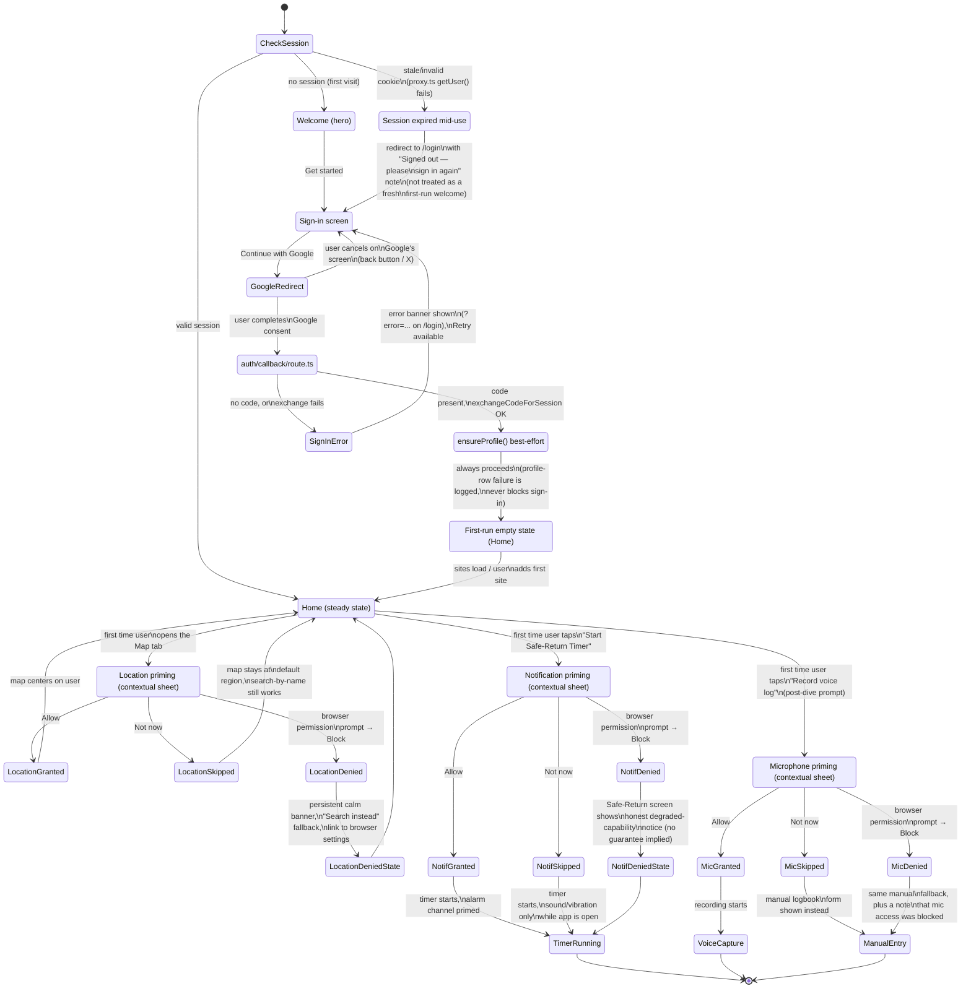

# Onboarding + Google Sign-In

Covers: first-run welcome, Google-only sign-in (`src/app/login/page.tsx` →
`src/app/auth/callback/route.ts`), contextual permission priming for
location / notifications / microphone, permission-denied degradation, and
the first-run empty state a brand-new signed-in user lands on. Designed
against `creative/design-system/DESIGN_SYSTEM.md` (binding) and grounded in
the real auth code already in `src/` (see file list below).

Mockups: `creative/mockups/onboarding/`.

## Flow / state diagram

## Key decisions

**1. Permissions are requested contextually, one at a time, never as an
onboarding gauntlet.** Location, notifications, and microphone are each
primed at the moment the corresponding feature is first used — opening the
map, starting the Safe-Return timer, and tapping "record voice log" — not
in a block on first launch. This follows both the letter and spirit of
CLAUDE.md's "avoid noisy/growth-hacky patterns" and the browser-permission
reality: a permission prompt shown with no immediate reason to grant it
gets reflexively denied, and a denial is far harder to recover from (most
browsers won't re-prompt; the user has to dig into site settings) than a
prompt shown at the exact moment its value is obvious. Sequencing three
prompts back-to-back at onboarding would also front-load risk — a user
denying "just to get through onboarding" burns a permission we might have
gotten later, at the point of genuine intent.

**2. Every priming screen explains what the user gets, never what the app
needs.** Per DESIGN_SYSTEM.md §7 and CLAUDE.md's safety-first tone, copy
is framed as "here's what turning this on unlocks" / "here's what stays
limited without it" — never "we need access to your microphone." This
mirrors `src/lib/safe-return/alert-channel.ts`'s existing `prime()`
convention: request from a deliberate user gesture, at the point the
capability is about to matter, not eagerly.

**3. "Not now" is always a real, undamaged path — not a dead end.** None of
the three permissions gate the app's core usefulness: without location the
map still works via search/browse; without notifications the Safe-Return
timer still runs with sound/vibration while the app is open (and says so
plainly); without microphone the post-dive prompt falls back to the same
manual entry form voice logging would have pre-filled. This is the same
principle CLAUDE.md states for offline caching ("best-effort, not
guaranteed, paired with a manual path") applied to permissions generally.

**4. Denied states are disclosed, not hidden or nagged.** Browsers don't
let a site re-trigger its own permission prompt once blocked, so a denied
permission gets a calm, persistent (not dismissible-and-forgotten, but also
not a modal that blocks the screen) status note explaining the real,
current limitation and a link to the browser's own settings — never a
red error toast, never a repeated re-ask. This is most load-bearing for
notifications, because a diver who blocked notifications and then starts
the Safe-Return timer must never be left thinking "the app will alert me"
when it can't — see `getStatus()`'s doc comment in `alert-channel.ts`,
which exists specifically so the UI can disclose exactly this.

**5. Session-expired is a distinct state from first-run, even though both
land on `/login`.** `src/proxy.ts` refreshes the session cookie on every
request and no-ops quietly on failure; if a previously-signed-in user's
session can't be refreshed, they still hit `/login`, but the copy there
should say "you were signed out" rather than re-running the full welcome
narrative (free/no-monetization pitch, platform-limitation disclosures) —
that framing is for first contact with the product, not a routine
re-auth. The sign-in mockup models the OAuth-failure banner
(`/login?error=...`, per `auth/callback/route.ts`'s redirect shape) as a
banner state on the same screen rather than a separate error page, since
that's exactly how the real route already behaves.

**6. `ensureProfile()` failure never blocks reaching the app.** Matches
the real code's explicit comment in `auth/callback/route.ts`: a
best-effort `profiles` row write is swallowed and logged, not surfaced to
the user. The flow diagram reflects this — `EnsureProfile` always proceeds
to `EmptyState` regardless of whether the row write actually succeeded.

**7. First-run empty state doubles as a brief loading state, not a second
blocking screen.** A brand-new account has zero dive-plan history and
(realistically, for a pre-launch hobby project) very few seeded sites.
Rather than a spinner-then-empty two-step, the empty-state mockup shows a
short, skeletal "finding sites near you" moment settling into the resolved
empty copy — calm, no spinner-as-suspense, respects
`prefers-reduced-motion`.
