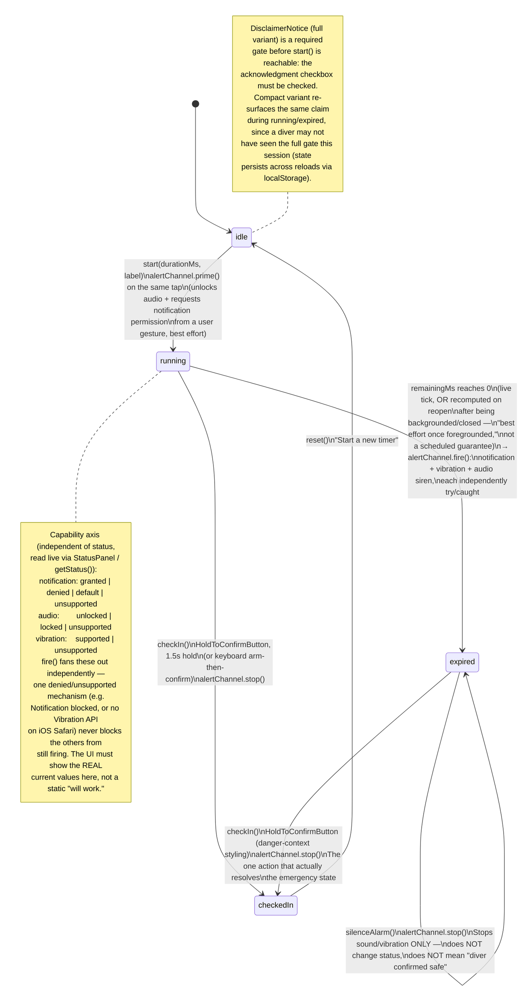

# Safe-Return Timer — flow

Source: `src/hooks/use-safe-return-timer.ts` (state machine), `src/lib/safe-return/alert-channel.ts` (capability axis), `src/components/safe-return/*` (views). Mockups: `creative/mockups/safe-return/`.

This is v1's **local-only** scope, by deliberate founder decision (see `CLAUDE.md`'s Safety pillar and `plan.md`'s Resolved Spec Decisions §1): no emergency contacts, no push, no SMS. The state machine below has exactly four statuses — `idle`, `running`, `checked-in`, `expired` — plus an independent, non-status **capability axis** (notification / audio / vibration) that the UI must disclose honestly at every point, never assumed.

## State diagram

## Screens delivered

| State | File | Capability shown |
|---|---|---|
| `idle` (start) | `mockups/safe-return/start.html` | pre-prime defaults (not yet permitted / not yet unlocked / supported) |
| `running` | `mockups/safe-return/running-full.html` | full capability: notification granted, audio unlocked, vibration supported |
| `running` | `mockups/safe-return/running-degraded.html` | degraded: notification **denied**, audio **locked**, vibration **unsupported** (iOS Safari-shaped) |
| `expired` | `mockups/safe-return/expired.html` | alarm actively firing — rose/danger treatment |
| `checked-in` | `mockups/safe-return/checked-in.html` | calm resolution, no capability panel (nothing left to disclose) |

`silenceAlarm()` isn't a separate screen — it's a same-screen action inside `expired.html` (the alarm keeps firing until either `silenceAlarm()` or `checkIn()` is pressed; both are shown as distinct controls with distinct visual weight, see rationale below).

## Rationale: urgency without panic on the expired/alarm screen

This was the hardest tone call in the flow, because the screen has to do two things that pull in opposite directions: **communicate that a real alarm is actively firing** (siren audio, vibration, a `requireInteraction: true` notification — three real mechanisms, per `alert-channel.ts`) **without implying an escalation the system doesn't have** — no incoming help, no contacted emergency services, no one else being paged. `CLAUDE.md` is explicit that a UI must never imply a guarantee it can't back, and this is the one screen where getting that wrong would do real harm (a diver assuming rescue is inbound when it isn't) or the opposite harm (a design so alarming it reads as a false catastrophe and gets dismissed/silenced reflexively rather than acted on).

Design decisions that resolve this:

1. **Color and motion carry the urgency, not new copy.** `rose` (per `DESIGN_SYSTEM.md` §2.2) is used for the first time consistently as the danger semantic — full-bleed rose-tinted header card, rose ring around the "alarm active" icon. Motion is a **slow (~1.2s), steady breathing pulse**, not a fast strobe — a deliberate departure from the "calm, nearly invisible" motion default elsewhere in the system (§6), because this is the one moment urgency *should* register, but a rapid flashing pattern reads as panic/glitch rather than "a device is calmly, deliberately alerting you." The pulse is fully disabled under `prefers-reduced-motion`, same as everywhere else.
2. **The copy is unchanged from the real component, verbatim.** "Timer expired[ — label]" / "You didn't check in. This device is alerting now — check what actually fired below." No added drama, no exclamation points, no "EMERGENCY" styling. The `StatusPanel`-style capability list is kept directly on this screen ("what actually fired") specifically because naming the real, bounded mechanisms (a notification, a vibration, a sound — on *this device*) is what keeps the moment honest and scoped, rather than a vague "help has been alerted."
3. **Silence vs. check-in get deliberately different visual weight**, matching the doc comment in `expired-view.tsx` about why they must never be conflated: **"Silence alarm"** is a secondary-weight, outlined, neutral (`zinc`) button — quiets the noise, nothing more, sized at the 44px floor. **"Hold to check in — I'm safe"** is the primary-weight action: full-width, 56px+, `emerald` (not `rose`) — a deliberate mockup choice on top of the real component's shared "danger" button styling for both hold-to-confirm instances in this flow. Using `emerald` here (the system's "safe/verified" semantic, per §2.2) rather than reusing `rose` gives the diver a clear color-coded mental model at a glance: rose = alarm/problem, emerald = the actual resolution, zinc = a minor, reversible, non-resolving action. The hold-to-confirm friction (1.5s hold, not a tap) stays exactly as built — that deliberate friction is doing real safety work here (an accidental brush shouldn't resolve a real emergency) and nothing about the visual pass changes it.
4. **Nothing implies escalation.** No progress indicator suggesting a call is in flight, no map pin, no "contacting…" state, no countdown-to-next-action. Once the alarm fires, the screen's job is to report what already happened (three local mechanisms) and offer exactly two honest next actions — it does not simulate momentum toward outside help that v1 structurally cannot provide.
