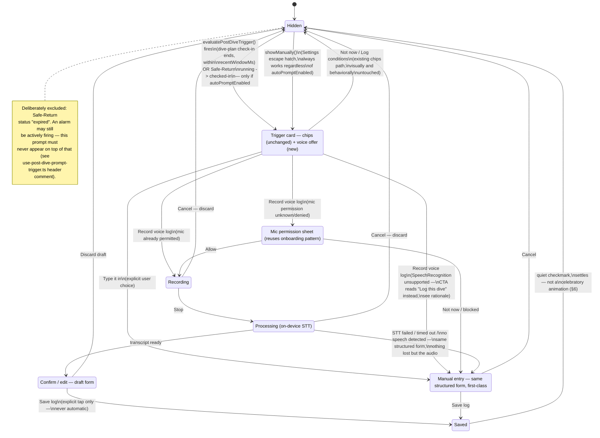

# Post-Dive Voice Logging — flow

Covers: the moment the existing single-tap condition prompt offers a fuller
voice-logged entry, on-device recording, the "processing" wait while STT
runs, the mandatory confirm/edit draft step, the manual-entry fallback, and
where the settings/escape-hatch controls live. Designed against
`creative/design-system/DESIGN_SYSTEM.md` (binding) and grounded in the real
trigger/settings code already in `src/`:

- `src/components/post-dive-prompt/post-dive-prompt.tsx` — the existing
  quick-tap conditions card (visibility/current/marine-life chips). Left
  functionally untouched — this flow adds to it, not replaces it.
- `src/hooks/use-post-dive-prompt-trigger.ts` — `evaluatePostDiveTrigger()`.
  Fires on `DivePlanCheckInState` active→inactive (within a 15-minute
  recency window) or the Safe-Return timer's `running → checked-in`
  transition. **Never** fires on `expired` — an alarm may still be sounding.
- `src/hooks/use-post-dive-prompt-settings.ts` — `autoPromptEnabled` (gates
  the automatic fire only) and the always-available `showManually()` escape
  hatch.
- No real voice-capture/STT/logbook UI exists yet — everything past the
  trigger card in this document is new design work, not a redesign of
  something shipped.

Mockups: `creative/mockups/voice-logging/`.

## Flow / state diagram

## Screens delivered

| Screen | File | What it shows |
|---|---|---|
| Trigger prompt | `mockups/voice-logging/01-trigger-prompt.html` | The real chips card, untouched, with a new "log the full dive" section offering Record / Type it in. Source eyebrow shows a real `PostDivePromptTriggerSource` value. |
| Recording | `mockups/voice-logging/02-recording.html` | Live level indicator, elapsed time in `tabular-nums`, Stop / Cancel, on-device disclosure. |
| Processing | `mockups/voice-logging/03-processing.html` | STT running, skeleton preview of the form about to appear, honest "taking longer than usual?" escape to manual entry. |
| Confirm / edit | `mockups/voice-logging/04-confirm-edit.html` | Structured draft form pre-filled from transcription — every field editable, per-field "Transcribed" / "Edited" tags, explicit draft framing, Save / Discard. |
| Manual entry fallback | `mockups/voice-logging/05-manual-entry.html` | Same structured form, empty, first-class framing — shown here in the STT-unsupported path with an honest, non-apologetic capability note. |
| Settings | `mockups/voice-logging/06-settings.html` | The real auto-prompt toggle, a live STT-capability status row, and the always-available "Log a dive now" manual entry point. |

## Rationale

### The trigger moment: additive, not a second prompt

The brief asks how the existing chip card "leads into or coexists with" a
voice offer. A sequential design — chip card, then (after it's dismissed) a
*second* card asking "want to add more detail?" — was considered and
rejected: `CLAUDE.md`'s zero-noise principle and the existing component's
own "single, low-friction card, one-tap dismiss" doc comment both argue
against stacking two prompts after one dive. Instead, `01-trigger-prompt.html`
keeps the real chip card completely intact (same fields, same copy, same
"Not now" / "Log conditions" pair at the bottom) and adds one new section
beneath it — a divider, a line of copy, and two buttons ("Record voice log" /
"Type it in"). One surface, one dismissal, two ways to engage with it. The
eyebrow line above the heading (`Safe-Return check-in · just now`) is a
mockup-only annotation showing which real `PostDivePromptTriggerSource`
produced this instance — useful for confirming the trigger contract stayed
intact, not a new UI element to implement.

### Confirm/edit: treated as a hard gate, not a nicety

`CLAUDE.md` is unambiguous — transcribed fields must be shown for
confirm/edit before saving, never auto-committed. `04-confirm-edit.html`
resolves this three ways, deliberately redundant so no single design choice
is load-bearing on its own:

1. **Structural**: there is no code path in the flow diagram from
   `Processing` to `Saved` that skips `ConfirmEdit` — the only edges into
   `Saved` originate from `ConfirmEdit` or `ManualEntry`, both of which
   require an explicit "Save log" tap.
2. **Visual**: every field carries a small dashed-border `zinc` tag reading
   "Transcribed," echoing (deliberately, not coincidentally) the visual
   language `provenance-badge.tsx` already uses for `MODEL_INFERRED` —
   muted, dashed, never confused with confirmed data. The moment a field is
   edited, its tag flips to a solid `sky` "Edited" tag — one field in this
   mockup (Max depth) is shown already edited, to demonstrate the
   transition rather than just assert it exists.
3. **Copy**: a persistent header badge ("Draft — not saved yet") plus a line
   directly above the action row ("Review before saving — this is a draft,
   not your logbook entry yet") repeats the same fact at the top and bottom
   of the screen, so it's visible regardless of scroll position on a small
   viewport.

A collapsible "raw transcript" quote block is included so a diver can check
a field against what they actually said, rather than trusting the
extraction blind — this is the same instinct as the Safe-Return screen's
"what actually fired" capability list: naming the real mechanism (a
transcript, bounded and visible) instead of asking for blind trust in an
inferred value.

### Manual entry: first-class, not an apology screen

`05-manual-entry.html` reuses the *exact same* structured form as
confirm/edit — same fields, same layout, same input components — with the
"Transcribed"/"Edited" tags simply absent (there's nothing to attribute).
The header reads "Log this dive," not "Voice logging failed" or "Sorry."
Where the flow requires an explanation (arriving here because
`SpeechRecognition` isn't available — the iOS Safari case `CLAUDE.md` calls
out by name), the copy states the fact plainly and immediately pivots to
capability: *"Voice logging needs browser support this device doesn't have
(common on iPhone Safari) — same structured log, just typed."* This mirrors
the tone already established in `onboarding/05-permission-microphone.html`
("Without it: 'Enter manually' opens the same logbook form, empty, no voice
step") and in the Safe-Return degraded-capability screen — state the
limitation once, plainly, then get out of the way. No retry loop, no
disabled ghost button begging to be tapped again; the primary action is
immediately usable.

The trigger card itself also reflects this honestly rather than offering a
button that's likely to fail: when `SpeechRecognition` is undetected, the
"Record voice log" button doesn't just error out after a tap — the card
detects this up front and swaps the CTA to "Log this dive," which routes
straight to `ManualEntry`. This is the same "best-effort, disclosed
honestly" pattern `CLAUDE.md` already requires for offline caching, applied
here to STT support instead of network reachability.

### Processing: a second, quieter honesty moment

`03-processing.html` exists because STT is explicitly a best-effort,
possibly-slow step, not a guaranteed instant round trip — the skeleton
preview of the form gives the diver something concrete to anticipate rather
than a bare spinner, and a visible "Cancel and enter manually" exit is
offered *during* processing, not only after a failure. A diver standing at
the water's edge with cold hands shouldn't be stuck waiting on a spinner
that might not resolve; the honest move is to make the fallback reachable
at every step, not just the one the code happens to land on.
